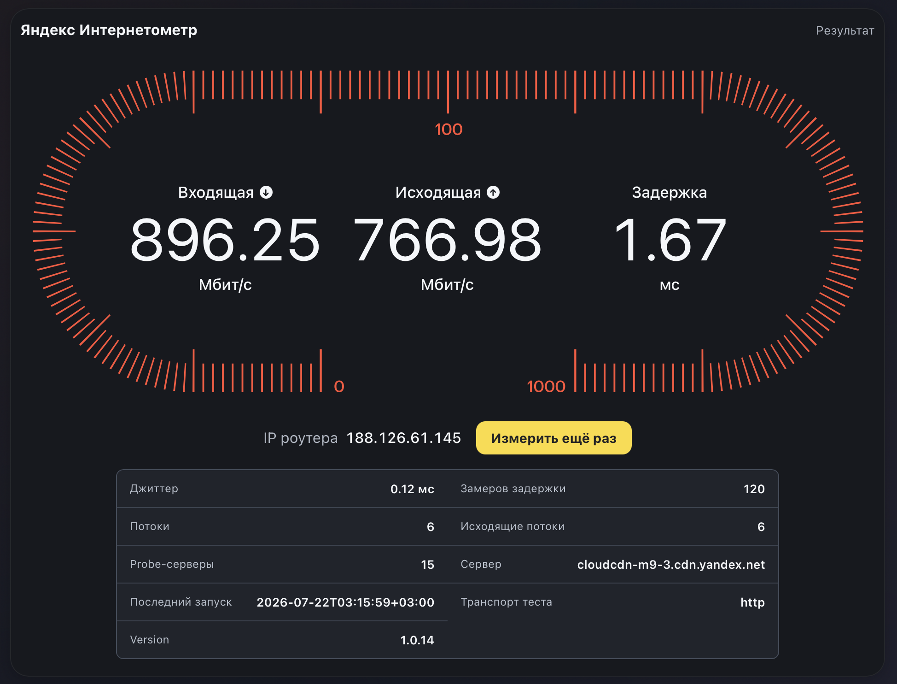

# Яндекс Интернетометр для OpenWrt

Неофициальный LuCI-интерфейс для router-side замера скорости через CDN Яндекса. Проект не связан с Яндексом.



[](https://github.com/sergeylopukhov/luci-app-yandex-internetometer/releases/latest)
[](https://openwrt.org/)
[](docs/install.sh)
[](LICENSE)

## 🚀 Установка

```sh
curl -fsSL https://sergeylopukhov.github.io/luci-app-yandex-internetometer/install.sh | sh -s -- --yes
```

Без `curl`:

```sh
wget -qO- https://sergeylopukhov.github.io/luci-app-yandex-internetometer/install.sh | sh -s -- --yes
```

Откройте `LuCI → Статус → Интернетометр`. Установщик сам выбирает `apk` или `opkg`, проверяет подпись репозитория либо SHA256 IPK и сохраняет UCI-настройки.

## 📊 Что измеряет

- входящую и исходящую скорость между роутером и CDN Яндекса;
- задержку и джиттер;
- фактический транспорт и число потоков.

Список probe-серверов и IP роутера всегда запрашиваются по HTTPS. В режиме `auto` синтетический download/upload идёт по HTTP после проверки CDN; если HTTP недоступен, приложение переключается на HTTPS и предупреждает о возможном ограничении CPU/TLS. Пользовательские данные по HTTP не передаются: upload содержит только нули. Промежуточный узел теоретически может повлиять на тестовые данные или результат.

## 🔄 Обновление

Та же команда обновляет установленный пакет. LuCI проверяет `version.json` по HTTPS раз в шесть часов и показывает ссылку на новый выпуск. Режимы транспорта: `auto`, `http` и `https`; HTTPS подходит для диагностики и быстрого отката.

## 🛟 Если не работает

Проверьте DNS, время роутера и наличие `curl`, `jq`. На слабых роутерах router-side результат зависит от CPU, памяти и числа потоков. Для legacy `opkg` пакет рассчитан на OpenWrt 24.10; APK-ветка покрыта полнее.

История версий: [RELEASE_NOTES.md](RELEASE_NOTES.md).
